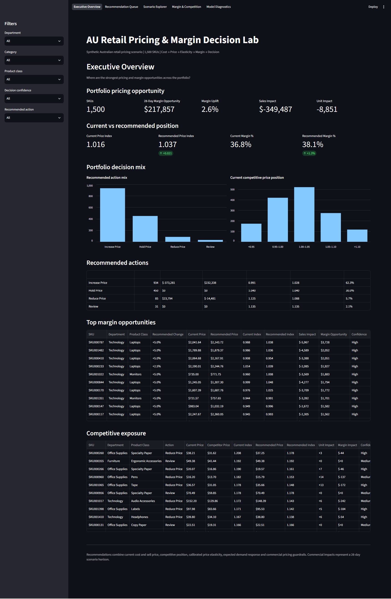
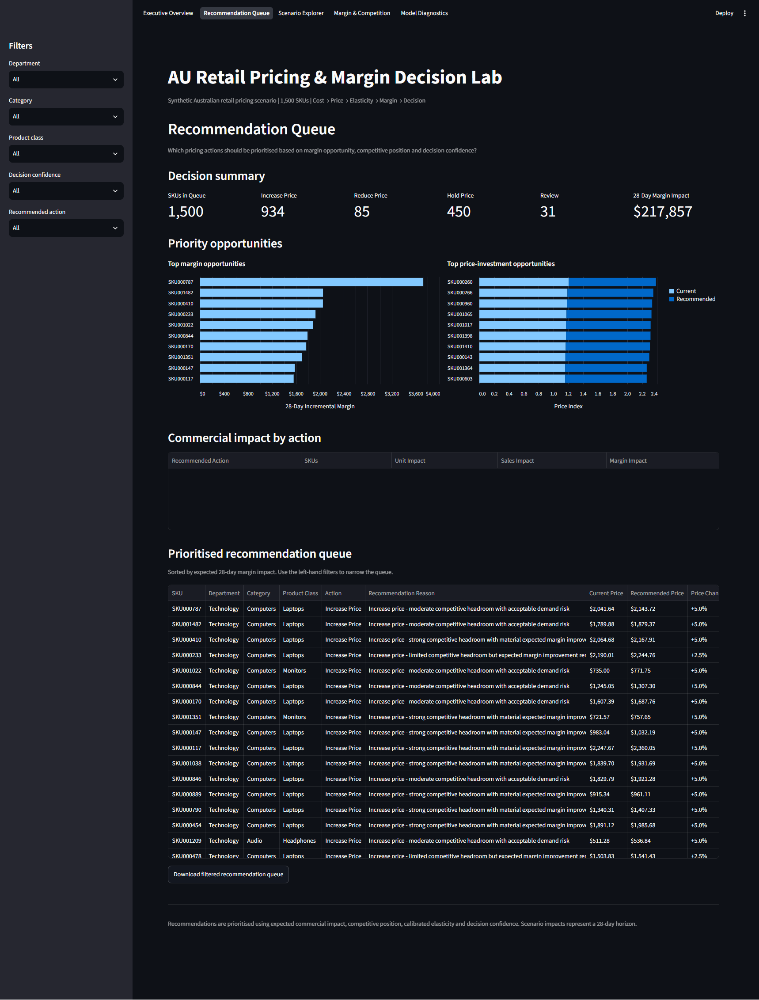
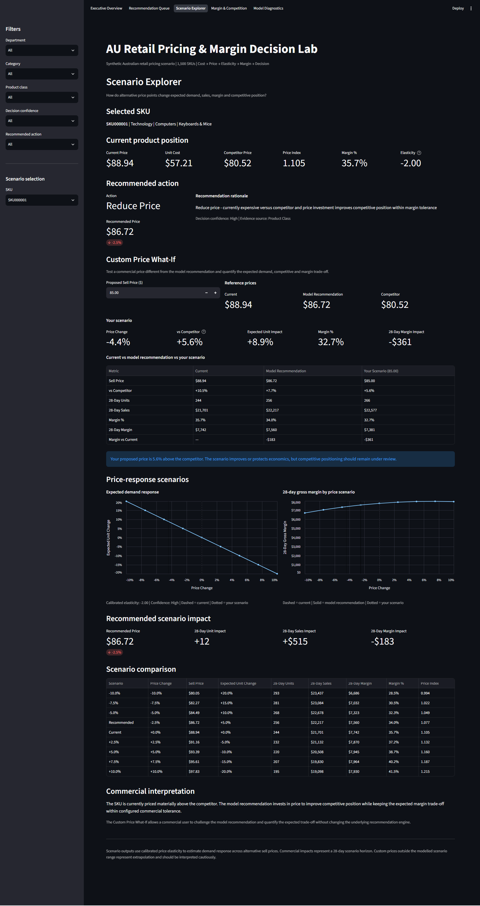
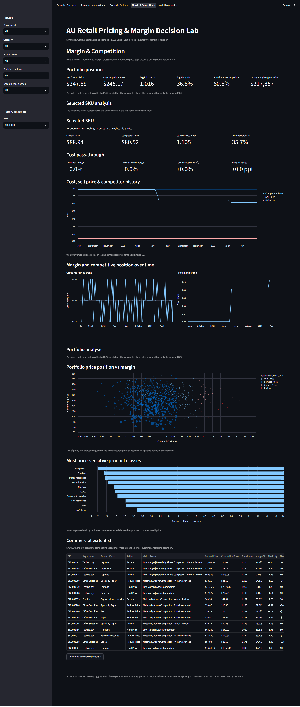
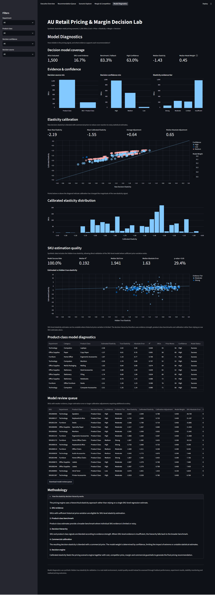

# AU Retail Pricing & Margin Decision Lab

An end-to-end retail pricing analytics portfolio project demonstrating how an Australian retailer can move from cost, competitor and demand signals to explainable SKU-level pricing decisions.

The project connects **cost movement → competitor position → price elasticity → commercial calibration → recommendation → scenario testing → model validation** in a single decision workflow.

> **Data note:** All SKU, price, cost, competitor, demand and elasticity records are synthetic. The project demonstrates analytical and decision-engineering methods, not observed retailer performance.

## Live Demo

🚀 **[Launch the AU Retail Pricing & Margin Decision Lab](https://au-retail-pricing-lab.streamlit.app/)**

Explore Executive Overview, Recommendation Queue, Scenario Explorer, Margin & Competition and Model Diagnostics interactively.

## Executive Summary

Pricing is not simply a margin calculation. A retailer can protect unit margin while becoming materially uncompetitive, or invest in price without generating enough incremental demand to justify the margin trade-off.

This project builds an analytical decision system around the questions that follow from that problem:

- Where are pricing risks and opportunities concentrated?
- Which SKUs are materially above or below competitor pricing?
- How have cost and sell-price movements affected margin?
- How sensitive is expected demand to a change in price?
- Should the business increase, hold, reduce or manually review price?
- What happens to units, sales and margin under alternative price points?
- What if a commercial user chooses a different price from the model recommendation?
- How strong is the evidence supporting the elasticity signal and recommendation?

The synthetic environment contains **1,500 SKUs** with a **two-year daily pricing and demand history**, competitor pricing, cost and margin history, hierarchical elasticity estimation, commercial calibration, scenario modelling, explainable pricing recommendations and automated QA.

## Decision Workflow

```text
Synthetic Retail Data
        ↓
Cost & Sell Price History
        ↓
Competitor Price Position
        ↓
Demand Response / Elasticity
        ↓
Hierarchical Evidence Selection
        ↓
Commercial Calibration
        ↓
Pricing Recommendation
        ↓
Scenario Testing
        ↓
Model Diagnostics
        ↓
Business Decision
```

The central design principle is:

> **Elasticity is an input to the pricing decision, not the decision itself.**

## Decision Lab Preview

### Executive Overview

**Where are the biggest pricing opportunities, and what actions should the business prioritise?**



<details>
<summary><strong>Recommendation Queue</strong> — Which SKUs should we increase, hold, reduce or review?</summary>

<br>



</details>

<details>
<summary><strong>Scenario Explorer</strong> — What happens if we accept the model price or test our own?</summary>

<br>



</details>

<details>
<summary><strong>Margin & Competition</strong> — Where are cost movements and competitor pricing creating risk or opportunity?</summary>

<br>



</details>

<details>
<summary><strong>Model Diagnostics</strong> — Can we trust the elasticity signal driving the pricing decisions?</summary>

<br>



</details>

## Interactive Decision Lab

The Streamlit application exposes five connected analytical views.

### 1. Executive Overview

**Question:** Where are the biggest pricing opportunities, and what actions should the business prioritise?

The portfolio view brings together current price, competitor position, margin, elasticity, recommendation confidence and estimated commercial opportunity.

It is designed to move pricing analysis away from isolated price-gap reporting and toward a prioritised decision view: where intervention matters, what action is suggested and why.

### 2. Recommendation Queue

**Question:** Which SKUs should the business increase, hold, reduce or review?

The decision engine combines competitive position, margin headroom, calibrated elasticity and commercial guardrails to generate one explainable action per SKU.

Recommendations are grouped into **Increase Price**, **Hold Price**, **Reduce Price** and **Review**. The queue is designed for commercial triage rather than automated price execution.

### 3. Scenario Explorer

**Question:** What happens to expected demand, sales and margin if we change the price?

For a selected SKU, the scenario engine evaluates alternative sell prices using calibrated elasticity and the current commercial position.

Outputs include expected unit response, 28-day units, 28-day sales, 28-day gross margin, margin %, competitor price index and recommended price impact versus the current position.

The **Custom Price What-If** extends the model recommendation into an interactive commercial decision tool. A user can enter a proposed sell price and compare three positions side by side:

- **Current** — the SKU's existing commercial position
- **Model Recommendation** — the price selected by the decision engine
- **Your Scenario** — a user-defined sell price

The custom scenario recalculates expected unit impact, competitive price position, 28-day units, sales, margin %, gross margin and incremental margin versus current. Price-response curves provide additional context around how demand and gross margin are expected to change across a range of alternative price points.

The objective is to make the trade-off explicit rather than treating the model recommendation as an instruction. A price reduction may improve competitiveness and demand while reducing gross margin dollars; a price increase may improve unit economics while weakening demand or competitive position.

### 4. Margin & Competition

**Question:** Where are cost movements, margin pressure and competitor price gaps creating pricing risk or opportunity?

The view separates **selected-SKU analysis** from **portfolio analysis**.

Selected-SKU diagnostics include current sell price, competitor price, price index, current margin %, cost pass-through, historical cost/sell/competitor price and margin and competitive position over time.

Portfolio views include price position versus margin, the most price-sensitive product classes and a commercial watchlist of SKUs requiring attention.

### 5. Model Diagnostics

**Question:** How reliable is the pricing signal, and what evidence supports each recommendation?

The diagnostics view makes the elasticity decision hierarchy visible rather than treating the model as a black box. It covers SKU-level evidence coverage, benchmark/fallback usage, decision confidence, elasticity evidence tier, raw versus calibrated elasticity, calibration adjustment, model weight, SKU estimation quality, product-class diagnostics and a model review queue.

Because the environment is synthetic, hidden true elasticity is available for direct validation of SKU-level estimation behaviour. In a real retail environment, this would instead be evaluated through holdout performance, experiments, stability monitoring and realised pricing outcomes.

## Why Hierarchical Elasticity Matters

SKU-level elasticity estimation is attractive in theory but unreliable when individual products have limited historical price variation or noisy demand.

The pricing engine therefore uses a hierarchy rather than forcing a SKU regression onto every product. Where SKU evidence is sufficiently strong, the individual signal can contribute to the decision. Where evidence is limited, the engine falls back toward broader product-class or benchmark information.

The result is a more robust decision input than simply accepting every regression coefficient at face value.

## Commercial Calibration

Raw statistical elasticity estimates can be extreme or unstable even when a model technically succeeds.

The project therefore adds a commercial calibration layer. Raw decision elasticity is blended with a benchmark prior, with the model contribution controlled by evidence strength and confidence. This deliberately reduces over-reaction to noisy statistical estimates.

The calibrated elasticity then feeds the scenario and recommendation engines rather than using the raw model estimate directly.

## Pricing Decision Engine

The recommendation engine combines current sell price, unit cost, competitor price, price index, gross margin, calibrated elasticity, evidence source, decision confidence and commercial pricing guardrails.

The objective is not to mechanically match competitor price or maximise margin percentage.

It is to identify commercially sensible price actions while balancing **competitiveness, demand response, margin economics and evidence quality**.

## Cost Pass-Through and Competitive Position

Cost changes do not automatically imply equivalent sell-price changes.

The Margin & Competition view tracks how cost and sell price have moved over time and exposes the resulting pass-through gap and margin movement. This provides context for questions such as whether cost increases have been recovered, whether sell price has moved faster than cost, whether competitor pricing has diverged, and whether there is enough margin headroom to invest in price.

## Synthetic Australian Retail Environment

The project uses synthetic data designed to resemble a multi-category Australian retail pricing environment, including:

- **1,500 SKUs**
- two years of daily history
- multiple departments, categories and product classes
- unit-cost movements
- regular sell-price changes
- competitor price movements
- SKU-level demand response
- different underlying elasticity profiles
- daily units and sales
- gross-margin outcomes

No real retailer transaction or pricing data is represented in the repository.

## Repository Structure

```text
au-retail-pricing-margin-decision-lab/
├── app.py
├── app_pages/
│   ├── 1_Executive_Overview.py
│   ├── 2_Recommendation_Queue.py
│   ├── 3_Scenario_Explorer.py
│   ├── 4_Margin_Competition.py
│   └── 5_Model_Diagnostics.py
├── data/
│   ├── generated/
│   ├── runtime/
│   └── sample/
├── docs/
│   └── images/
├── notebooks/
├── outputs/
├── src/
│   ├── app/
│   ├── data_generation/
│   ├── decision_engine/
│   ├── modelling/
│   ├── pricing/
│   └── qa/
├── tests/
└── pytest.ini
```

Generated datasets and runtime outputs are excluded from Git where appropriate.

## Testing and Portfolio QA

The project includes automated tests covering the core pricing and demand logic.

Current test suite:

```text
23 passed
```

Tests cover competitor price construction, price-index and price-gap calculations, daily demand integrity, sales and gross-margin reconciliation, expected demand response to price, price-response event logic, pricing recommendation guardrails, one recommendation per SKU and valid recommendation actions.

The custom price scenario logic is also tested for three core commercial behaviours:

- holding the current price produces no incremental commercial impact
- increasing price reduces expected units according to elasticity and recalculates gross margin
- reducing price increases expected units and improves the competitive price index

## Reproducibility

### Activate the environment

```bash
conda activate au-retail-pricing
```

### Run tests

```bash
pytest -v
```

### Launch the decision application

```bash
streamlit run app.py
```

## Methodology

The elasticity decision hierarchy follows five broad stages:

1. **SKU evidence** — SKUs with sufficient historical price variation are eligible for SKU-level elasticity estimation.
2. **Product-class benchmark** — Product-class estimates provide a broader benchmark where individual SKU evidence is limited or noisy.
3. **Decision hierarchy** — SKU and product-class signals are combined according to evidence strength, with fallback to the broader benchmark where required.
4. **Commercial calibration** — The resulting decision elasticity is blended with a commercial prior. Model weight is determined by confidence to limit the influence of unstable estimates.
5. **Decision engine** — Calibrated elasticity is combined with cost, competitor price, margin and commercial guardrails to generate the final pricing recommendation.

## Limitations

This is a portfolio decision-analytics prototype rather than a production pricing optimisation system. Important limitations include:

- synthetic rather than observed retailer data
- simplified competitor-price dynamics
- simplified demand response
- elasticity modelled independently of promotions and broader marketing effects
- no explicit cross-price elasticity or substitution modelling
- no customer-segment elasticity
- no inventory or supply constraint in the pricing optimiser
- no tax, channel or location-specific pricing complexity
- commercial guardrails are analytical assumptions rather than production-calibrated rules
- custom price scenarios assume the calibrated elasticity signal applies across the tested price range
- scenario outputs demonstrate model behaviour rather than recommended real-world price changes

## Potential Next Steps

Production-oriented extensions could include promotional and markdown effectiveness, cross-price elasticity and product substitution, customer-segment or cohort response, inventory-aware pricing, store/channel-level pricing, Bayesian or hierarchical elasticity modelling, controlled pricing experiments, competitor-price monitoring, price architecture and key-value-item logic, automated model monitoring, realised-outcome measurement and production data orchestration.

## Skills Demonstrated

**Analytics & Data Science:** business problem framing, synthetic data design, demand-response modelling, elasticity estimation, statistical diagnostics, hierarchical evidence selection, model calibration and validation.

**Decision Analytics:** competitor price analysis, margin analysis, cost pass-through, explainable pricing recommendations, commercial guardrails, custom price what-if analysis, scenario modelling, price-response trade-offs and decision prioritisation.

**Analytics Engineering:** modular Python development, parquet-based analytical datasets, automated testing, Streamlit application development, reusable filters, Git-ready project organisation and technical documentation.

## Project Perspective

The project is intentionally designed around the connection between **pricing analytics and commercial action**.

A statistically estimated elasticity is not automatically a reliable decision signal. A price can carry a healthy margin while being materially above the market. A price reduction can generate more demand and sales while still destroying gross margin dollars. A price increase can improve margin rate while weakening competitive position.

The analytical objective is therefore not simply to estimate elasticity or report price gaps.

> **Where is the pricing opportunity, what should we do about it, and what is the expected commercial trade-off?**
